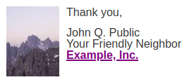

<h1 align="center">MJML Sign-Off: <code>&lt;mj-signoff&gt;</code></h1>

<!-- This component's documentation and README need to stay in sync. Make sure
     to make any updates here in both places:

     https://premail.dev/docs/components/mjml-signoff/
     https://github.com/premail/mjml-signoff/blob/main/README.md

     Should differences exist, the README is considered canonical as it is
     published to npm:
     https://www.npmjs.com/package/mjml-signoff
-->

<div align="center">
  <strong>Sign your MJML emails in style</strong><br />
  <br />
  <a href="https://github.com/premail/mjml-signoff/issues/new?assignees=&labels=Type%3A+Bug&template=01_bug_report.yml&title=bug%3A+">Report a Bug</a>
  &bullet;
  <a href="https://github.com/premail/mjml-signoff/issues/new?assignees=&labels=Type%3A+Feature&template=02_feature_request.yml&title=feat%3A+">Request a Feature</a>
  &bullet;
  <a href="https://github.com/premail/mjml-signoff/issues/new?assignees=&labels=Type%3A+Question&template=03_support_question.yml&title=support%3A+">Ask a Question</a>
</div>

<div align="center">
<br />

[](https://www.npmjs.com/package/mjml-signoff)
[](https://github.com/premail/mjml-signoff/releases)
[](https://github.com/premail/premail/releases/latest)
[](https://github.com/mjmlio/mjml/releases)
[](https://github.com/premail/mjml-signoff/blob/main/LICENSE)
[](https://github.com/premail/mjml-signoff/issues?q=is%3Aissue+is%3Aopen+label%3A%22help+wanted%22%2C%22Status%3A+Available%22+sort%3Aupdated-desc+)

</div>

---

<a href="https://github.com/premail"></a><strong>This
MJML component is brought to you by
<a href="https://github.com/premail">Premail</a>, and the following
documentation can also be found at
<a href="https://premail.dev/docs/components/mjml-signoff">https://premail.dev/docs/components/mjml-signoff</a></strong>

---

Designed for the sign-off or signature section at the bottom of your email
content, the `<mj-signoff>` tag allows you to easily include an image alongside
your signature such as a photo or logo, which is a common best practice in many
types of emails:



---

- [Usage](#usage)
  - [Coding](#coding)
  - [Styling](#styling)
  - [Options](#options)
  - [Adding this to your emails](#adding-this-to-your-emails)
  - [Fork or contribute to this component](#fork-or-contribute-to-this-component)
- [Alternatives](#alternatives)
- [Security](#security)
- [License](#license)

# Usage

## Coding

This MJML:

```html
<mjml>
  <mj-body>
    <mj-section>
      <mj-column>
        <mj-signoff
          closing="Thank you,"
          name="John Q. Public"
          title="Your Friendly Neighbor"
          image-src="https://picsum.photos/75/100"
          image-width="75px"
          image-height="100px"
          image-alt=""
        >
          <p><a href="https://example.com">Example, Inc.</a></p>
        </mj-signoff>
      </mj-column>
    </mj-section>
  </mj-body>
</mjml>
```

Will produce the following visual representation:


The `closing`, `name` and `title` strings are all optional, as are an additional
`title2` and `title3` strings. These strings cannot contain HTML elements,
however any content within the element itself is placed in the text column below
the optional strings -- for instance, the wrapped and linked company name shown
above. `<mj-signoff>` need not have any content within its tags, however.

The wrapper `<p>` and `<div>` elements are only inserted if the corresponding
strings are set. A simplified version of the [generated HTML](docs/example.html)
is:

```html
<div class="signoff">
  <!-- table markup -->
  <div class="signoff__image-wrapper">
    <!-- table markup, class="signoff__image" -->
    
    <!-- table markup -->
  </div>
  <div class="signoff__text-wrapper">
    <!-- table markup, class="signoff__text" -->
    <p class="signoff__closing"><!-- if string is set --></p>
    <p class="signoff__name"><!-- if string is set --></p>
    <p class="signoff__title"><!-- if string is set --></p>
    <p class="signoff__title2"><!-- if string is set --></p>
    <p class="signoff__title3"><!-- if string is set --></p>
    <div class="signoff__custom">
      <!-- if <mj-signoff> element has content -->
    </div>
    <!-- table markup -->
  </div>
  <!-- table markup -->
</div>
```

The order of the image and text columns is reversed if `image-position` is set
to `right`.

## Styling

The following `mj-class` elements are available for styling with
[`<mj-attributes>`](https://documentation.mjml.io/#mj-attributes):

- `signoff`
- `signoff__image-wrapper`
- `signoff__image`
- `signoff__text-wrapper`
- `signoff__text`

And the following CSS classes are available for styling with
[`<mj-style>`](https://documentation.mjml.io/#mj-style):

- `signoff`
- `signoff__image-wrapper`
- `signoff__image`
- `signoff__text-wrapper`
- `signoff__text`
- `signoff__closing`
- `signoff__name`
- `signoff__title`
- `signoff__title2`
- `signoff__title3`
- `signoff__custom`

You can see how each of these are used in the
[example MJML file](docs/example.mjml).

## Options

Available options for `<mj-signoff>`:

| option                | unit                      | details                                                                                                                                                                                                                                                                                                                                                                                                                                         | default value |
| --------------------- | ------------------------- | ----------------------------------------------------------------------------------------------------------------------------------------------------------------------------------------------------------------------------------------------------------------------------------------------------------------------------------------------------------------------------------------------------------------------------------------------- | ------------- |
| `closing`             | string                    | Optional closing, e.g. `Thank you,`                                                                                                                                                                                                                                                                                                                                                                                                             | none          |
| `name`                | string                    | Optional name, e.g. `John Q. Public`                                                                                                                                                                                                                                                                                                                                                                                                            | none          |
| `title`               | string                    | Optional title, e.g. `Your Friendly Neighbor`                                                                                                                                                                                                                                                                                                                                                                                                   | none          |
| `title2`              | string                    | Optional title line two, e.g. `Example, Inc.`                                                                                                                                                                                                                                                                                                                                                                                                   | none          |
| `title3`              | string                    | Optional title line three, e.g. `(202) 555-1212`                                                                                                                                                                                                                                                                                                                                                                                                | none          |
| `section-padding`     | pixels                    | Applies to entire element                                                                                                                                                                                                                                                                                                                                                                                                                       | `10px 0`      |
| `section-align`       | `left`, `center`, `right` | Alignment of element as a whole                                                                                                                                                                                                                                                                                                                                                                                                                 | `left`        |
| `background-color`    | color                     | Applies to entire element                                                                                                                                                                                                                                                                                                                                                                                                                       | none          |
| `image-position`      | `left`, `right`           | Where the image should appear relative to the text                                                                                                                                                                                                                                                                                                                                                                                              | `left`        |
| `image-padding`       | pixels                    | Applies only to the image column                                                                                                                                                                                                                                                                                                                                                                                                                | none          |
| `image-src`           | URL                       | Location of image                                                                                                                                                                                                                                                                                                                                                                                                                               | none          |
| `image-width`         | pixels                    | Width of image                                                                                                                                                                                                                                                                                                                                                                                                                                  | none          |
| `image-height`        | pixels                    | Height of image                                                                                                                                                                                                                                                                                                                                                                                                                                 | none          |
| `image-alt`           | string                    | Alternative text for image (you may legitimately wish to leave this blank; see [the spec for graphical representation](https://html.spec.whatwg.org/multipage/images.html#a-graphical-representation-of-some-of-the-surrounding-text), [decorative images](https://html.spec.whatwg.org/multipage/images.html#a-purely-decorative-image-that-doesn't-add-any-information) and [example 2 here](https://webaim.org/techniques/alttext/#context)) | none          |
| `text-column-padding` | pixels                    | Applies only to the text column                                                                                                                                                                                                                                                                                                                                                                                                                 | `0 10px`      |

## Adding this to your emails

In your MJML project directory, install this package via npm:

```sh
npm install mjml-signoff
```

In your build process script (such as gulp), require the package:

```js
const mjmlSignoff = require('mjml-signoff')
```

or

```js
import mjmlSignoff from mjml-signoff
```

Finally, add the package to your `.mjmlconfig`:

```json
{
  "packages": ["mjml-signoff"]
}
```

You can now use `<mj-signoff>` in your MJML emails.

## Fork or contribute to this component

If you want to edit this component, first grab it via git:

```sh
git clone https://github.com/premail/mjml-signoff.git
```

Navigate to the folder and install:

```sh
cd mjml-signoff
npm install
```

Edit the component script file in `./components/`, then run `gulp build` or
`gulp watch` to compile. We include
[sheerun/modern-node](https://github.com/sheerun/modern-node), which formats and
lints code automatically on commits using [Prettier](https://prettier.io/) and
[ESLint](https://eslint.org/). You can use `npm run format` and `npm run lint`
on their own as well.

To run tests, use `npm run test`

If you want to use a forked version of this component in your emails without
having to publish it to npm, see
[premail/mjml-custom-component](https://github.com/premail/mjml-custom-component)
for a guide.

# Alternatives

As an alternative to `<mjml-signoff>`, you can use the
[`<mj-group>`](https://documentation.mjml.io/#mj-group) element, but note its
warning for iOS 9.

If you are not using an image in your sign-off, or you are including an image on
a line by itself (such as an image of a signature) you can simply use the
default `<mj-image>` and `<mj-text>` elements.

# Security

Legalese: This component is provided **"as is"** without any warranty. Use at
your own risk.

_For more information and to report security issues, please refer to our
[security documentation](https://github.com/premail/mjml-signoff/blob/main/docs/SECURITY.md)._

# License

`mjml-signoff` is licensed under the GNU Affero General Public License v3.0 or
later. To be clear: This license only covers the component's code, _not_ any
content you generate _using_ it.

For the legal details of the AGPL, see the complete
[LICENSE](https://github.com/premail/mjml-signoff/blob/main/LICENSE).
