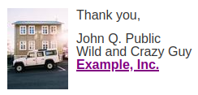

# MJML Sign-Off: `<mj-signoff>`

Designed for the sign-off or signature section at the bottom of your email
content, the `<mj-signoff>` tag allows you to easily include an image alongside
your signature such as a photo or logo, which is a common best practice in many
types of emails.

## Usage

This MJML:

```html
<mjml>
  <mj-body>
    <mj-section>
      <mj-column>
        <mj-signoff
          closing="Thank you,"
          name="John Q. Public"
          title="Wild and Crazy Guy"
          image-src="https://picsum.photos/75/100"
          image-width="75px"
          image-height="100px"
          image-alt=""
        >
          <p><a href="https://example.com">Example, Inc.</a></p>
        </mj-signoff>
      </mj-column>
    </mj-section>
  </mj-body>
</mjml>

```

Will produce the following:



The `closing`, `name` and `title` strings are all optional, as are an
additional `title2` and `title3` strings. These strings cannot contain HTML
elements, however any content within the element itself is placed in the text
column below the optional strings -- for instance, the wrapped and linked
company name shown above. `<mj-signoff>` need not have any content within its
tags, however.

The wrapper `<p>` and `<div>` elements are only inserted if the corresponding strings are set. A simplified version of the [generated HTML](examples/index.html) is:

```html
<div class="signoff">
  <!-- table markup -->
    <div class="signoff__image-wrapper">
      <!-- table markup, class="signoff__image" -->
        
      <!-- table markup -->
    </div>
    <div class="signoff__text-wrapper">
      <!-- table markup, class="signoff__text" -->
        <p class="signoff__closing"><!-- if string is set --></p>
        <p class="signoff__name"><!-- if string is set --></p>
        <p class="signoff__title"><!-- if string is set --></p>
        <p class="signoff__title2"><!-- if string is set --></p>
        <p class="signoff__title3"><!-- if string is set --></p>
        <div class="signoff__custom">
          <!-- if <mj-signoff> element has content -->
        </div>
      <!-- table markup -->
    </div>
  <!-- table markup -->
</div>
```

The order of the `signoff__image` and `signoff__text` columns is reversed if `image-position` is set to `right`.

The following `mj-class` elements are available for styling with [`<mj-attributes>`](https://documentation.mjml.io/#mj-attributes):

- `signoff`
- `signoff__image-wrapper`
- `signoff__image`
- `signoff__text-wrapper`
- `signoff__text`

And the following CSS classes are available for styling with [`<mj-style>`](https://documentation.mjml.io/#mj-style)

- `signoff`
- `signoff__image-wrapper`
- `signoff__image`
- `signoff__text-wrapper`
- `signoff__text`
- `signoff__closing`
- `signoff__name`
- `signoff__title`
- `signoff__title2`
- `signoff__title3`
- `signoff__custom`

You can see how each of these are used in the [example MJML file](examples/index.mjml).

## `<mj-signoff>` options

Available options for this component include:


| option                | unit                      | details                                                                                                                                                                                                                                                                                                                                                                                                                                         | default value |
| --------------------- | ------------------------- | ----------------------------------------------------------------------------------------------------------------------------------------------------------------------------------------------------------------------------------------------------------------------------------------------------------------------------------------------------------------------------------------------------------------------------------------------- | ------------- |
| `closing`             | string                    | Optional closing, e.g. `Thank you,`                                                                                                                                                                                                                                                                                                                                                                                                             | none          |
| `name`                | string                    | Optional name, e.g. `John Q. Public`                                                                                                                                                                                                                                                                                                                                                                                                            | none          |
| `title`               | string                    | Optional title, e.g. `Wild and Crazy Guy`                                                                                                                                                                                                                                                                                                                                                                                                       | none          |
| `title2`              | string                    | Optional title line two, e.g. `ACME Corp.`                                                                                                                                                                                                                                                                                                                                                                                                      | none          |
| `title3`              | string                    | Optional title line three, e.g. `(202) 555-1212`                                                                                                                                                                                                                                                                                                                                                                                                | none          |
| `section-padding`     | pixels                    | Applies to entire element                                                                                                                                                                                                                                                                                                                                                                                                                       | `10px 0`      |
| `section-align`       | `left`, `center`, `right` | Alignment of element as a whole                                                                                                                                                                                                                                                                                                                                                                                                                 | `left`        |
| `background-color`    | color                     | Applies to entire element                                                                                                                                                                                                                                                                                                                                                                                                                       | none          |
| `image-position`      | `left`, `right`           | Where the image should appear relative to the text                                                                                                                                                                                                                                                                                                                                                                                              | `left`        |
| `image-padding`       | pixels                    | Applies only to the image column                                                                                                                                                                                                                                                                                                                                                                                                                | none          |
| `image-src`           | URL                       | Location of image                                                                                                                                                                                                                                                                                                                                                                                                                               | none          |
| `image-width`         | pixels                    | Width of image                                                                                                                                                                                                                                                                                                                                                                                                                                  | none          |
| `image-height`        | pixels                    | Height of image                                                                                                                                                                                                                                                                                                                                                                                                                                 | none          |
| `image-alt`           | string                    | Alternative text for image (you may legitimately wish to leave this blank; see [the spec for graphical representation](https://html.spec.whatwg.org/multipage/images.html#a-graphical-representation-of-some-of-the-surrounding-text), [decorative images](https://html.spec.whatwg.org/multipage/images.html#a-purely-decorative-image-that-doesn't-add-any-information) and [example 2 here](https://webaim.org/techniques/alttext/#context)) | none          |
| `text-column-padding` | pixels                    | Applies only to the text column                                                                                                                                                                                                                                                                                                                                                                                                                 | `0 10px`      |


## Alternatives

As an alternative to `<mjml-signoff>`, you can use the
[`<mj-group>`](https://documentation.mjml.io/#mj-group) element, but note its
warning for iOS 9.

If you are not using an image in your sign-off, or you are including an image
on a line by itself (such as an image of a signature) you can simply use the
default `<mj-text>` element.

## Use this in your emails

Install via npm:

```
npm install mjml-signoff
```

Add the package to your `.mjmlconfig`:

```
{
  "packages": [
    "mjml-signoff/lib/index.js"
  ]
}
```

## Fork or contribute to this component

Grab via git:

```
git clone https://github.com/premail/mjml-signoff.git
```

Navigate to the folder and install:

```
cd mjml-signoff
npm install
```

Edit the component script file in `./components/`, then run `gulp build` or `gulp watch` to compile.

If you want to use a forked version of this component without having to publish it to npm, see [premail/mjml-custom-component](https://github.com/premail/mjml-custom-component) for a guide.

## License

GPLv3. See [LICENSE](LICENSE).
